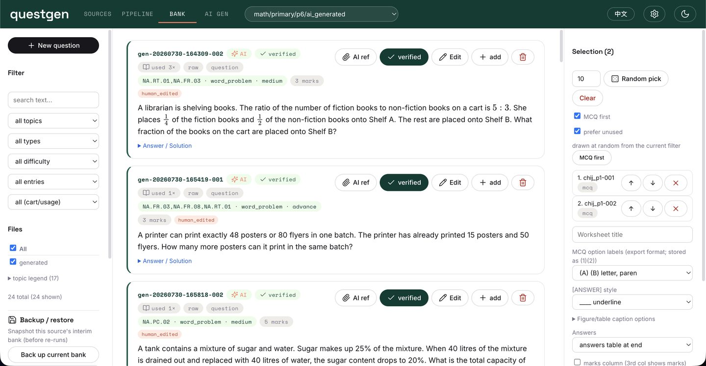
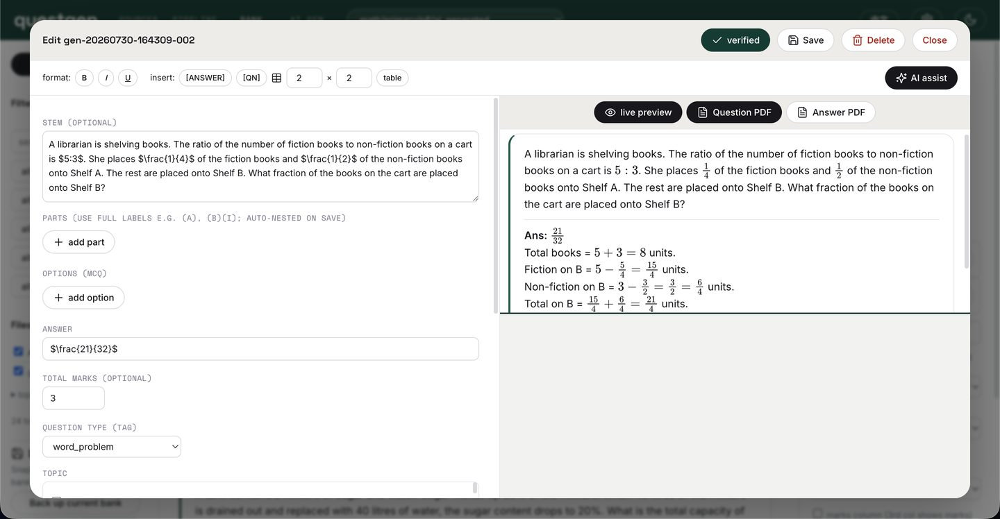
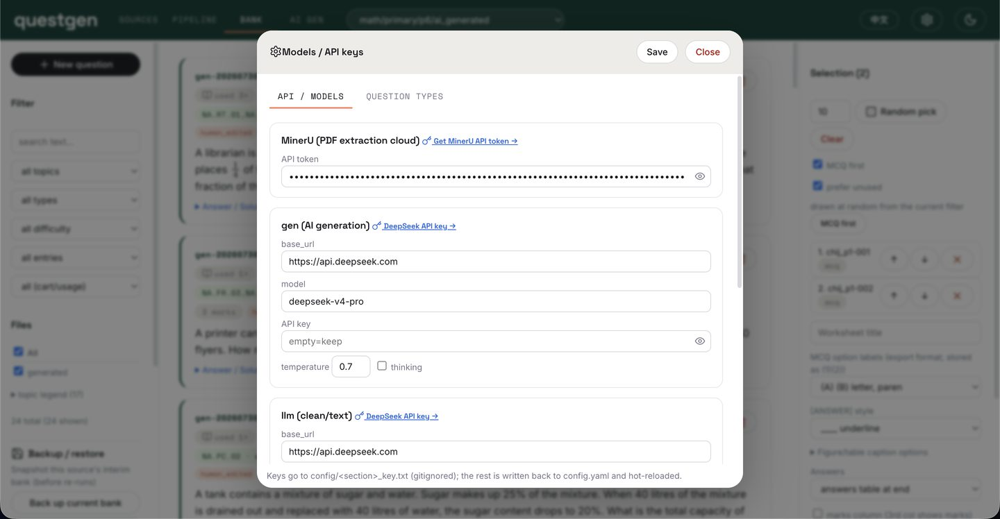
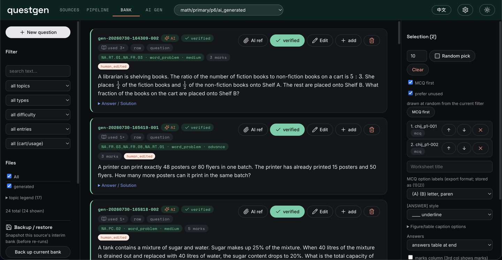

# questgen

A local, single-operator pipeline for turning exam/worksheet **PDFs into a clean, tagged
question bank** — and assembling that bank back into **`.docx` worksheets**. Built for the
Singapore school syllabus, but the structure is subject-agnostic.

Everything runs on your machine through one **stdlib HTTP dashboard** (no framework, no build
step). The only external calls are to a PDF-extraction service (MinerU) and an
OpenAI-compatible LLM endpoint — both optional and configured by you.

```
PDF ──▶ extract (MinerU) ──▶ interim jsonl ──▶ clean (LLM) ──▶ tag (LLM) ──▶ SQLite
 (Sources)     (Pipeline) ······································· (Pipeline) ····▶ (Bank) ──▶ .docx
```

## Screenshots

| Bank — browse / filter / export | Item editor with live preview |
|---|---|
|  |  |

| Settings — models & API keys (masked) | Dark theme |
|---|---|
|  |  |

---

## Features

- **Sources** — upload PDFs *or images* (images are normalized to 1-page PDFs), preview pages,
  crop / mask / select page ranges, and save cleaned pages for extraction.
- **Pipeline** — one-click `extract → interim → clean → tag → build DB`, with per-step controls,
  a live log, and a guard that warns + auto-backs-up before overwriting a bank with manual edits.
- **Bank** — browse, search, and filter questions (by topic / type / difficulty / verified /
  usage); edit any field with a live LaTeX/table preview; **manually add** questions;
  **AI-assist** a text selection (e.g. "rewrite this into `\ce{}` syntax"); select questions into
  a cart and **export `.docx` worksheets** (student + teacher/answer copies, optional marks column,
  figure/table captions, `[Total]` rows); backup / restore; label normalization; edit history.
- **AI generation** — generate new questions using your bank as few-shot context, with a
  novelty check against existing questions; review queue to accept / reject.
- **Bilingual UI** — English / 中文 toggle, light / dark themes.

## Requirements

- **Python 3.10+**
- Python packages in `requirements.txt` (PyMuPDF, python-docx, Pillow, requests, PyYAML,
  latex2mathml, mathml2omml).
- Optional external services (bring your own keys):
  - **MinerU** API token — cloud PDF extraction (https://mineru.net)
  - An **OpenAI-compatible LLM** endpoint — for the clean/tag steps and AI generation
    (e.g. DeepSeek, DashScope/Qwen, or a local Ollama server). Without one, extraction and
    manual editing still work; the LLM steps are simply skipped.

## Installation

```bash
git clone https://github.com/ts-flake/questgen.git
cd questgen
python3 -m venv .venv && source .venv/bin/activate      # optional but recommended
pip install -r requirements.txt
```

## Configuration & keys

Settings live in `config/config.yaml` (endpoints, models, defaults). **API keys are never
stored in that file or committed.** Provide them either way:

- **In the dashboard** — open **⚙ Settings**, paste your MinerU token / LLM keys, Save. They are
  written to `config/*_key.txt`, which is git-ignored.
- **On disk** — create the files directly:
  ```
  config/mineru_token.txt   # MinerU API token
  config/llm_key.txt        # LLM API key
  config/vlm_key.txt        # (optional) vision endpoint key
  config/gen_key.txt        # (optional) generation endpoint key
  ```

### Directory layout — self-contained

The repo is **self-contained**; it does **not** need any special parent-folder structure. With
the default `content_root: content` in `config.yaml`, everything lives inside the cloned folder:

```
questgen/           # the repo (= project root)
├── scripts/ static/ config/     # code + UI + config (committed)
├── content/         # YOUR question sources        (git-ignored, you create this)
└── outputs/         # exported .docx worksheets     (git-ignored, auto-created)
```

`content/` and `outputs/` are created locally and never committed. If you'd rather keep your data
outside the repo, point `content_root` to an absolute path in `config.yaml`, or set the
`QUESTGEN_CONTENT` environment variable.

## Usage

```bash
python3 scripts/dashboard.py
# → open http://127.0.0.1:8760
```

Typical workflow:

1. **Sources** — upload a PDF, trim/mask pages if needed, save to `raw/`.
2. **Pipeline** — select the file and run the steps (or "one-click"). Configure your MinerU token
   and LLM endpoint first (⚙ Settings) if you want extraction + auto-clean/tag.
3. **Bank** — review, edit, verify, and tag questions. Add questions manually if you like.
4. Select questions into the cart and **export** a `.docx` worksheet.

Content is organized as `content/<subject>/<stage>/<level>/<source>/{original,raw,extracted,interim}`.
Sources are auto-discovered; a per-subject taxonomy (`_taxonomy/knowledge_tree.yaml`) enables topic
tagging. You create these under `content/` — they are your data and are git-ignored.

### Command line

The pipeline scripts are also runnable directly (each takes `--subject/--stage/--level/--source`):

```bash
python3 scripts/mineru_extract.py --source my_source     # extract
python3 scripts/interim_build.py  --source my_source     # deterministic segment → interim jsonl
python3 scripts/llm_clean.py      --source my_source     # LLM clean
python3 scripts/llm_tag.py        --source my_source     # LLM tag (taxonomy)
python3 scripts/build_db.py                              # assemble SQLite
```

## Project structure

```
questgen/
├── scripts/            # the pipeline + dashboard server (pure stdlib + a few libs)
│   ├── dashboard.py    #   local HTTP dashboard (serves static/, drives the pipeline)
│   ├── context.py      #   path resolution + config
│   ├── source_ops.py   #   PDF crop/mask/merge (page prep)
│   ├── mineru_extract.py
│   ├── interim_build.py, llm_segment.py     # PDF layout → structured interim jsonl
│   ├── table_split.py  #   splits layout tables that hold whole questions
│   ├── llm_clean.py, llm_tag.py, llm_gen.py # LLM clean / tag / generate
│   ├── build_db.py     #   interim jsonl → SQLite
│   └── export_docx.py  #   question bank → .docx worksheets
├── static/             # dashboard UI (index.html + dashboard.css + dashboard.js)
├── config/             # config.yaml (keys live in gitignored *_key.txt)
├── docs/               # INTERIM_SCHEMA.md — the question-bank contract
├── requirements.txt
└── content/            # YOUR sources + outputs/ (git-ignored, created locally)
```

## Notes

- **jsonl is the source of truth.** The interim `*.jsonl` files are the editable product; the
  SQLite DB is a rebuildable index.
- Extraction preserves MinerU's `$…$` / `$$…$$` math and HTML tables verbatim — downstream steps
  do not rewrite them.
- The dashboard binds to `127.0.0.1` only. It reads and writes your local content tree directly,
  so run it against your own data.

This is a personal v1 — pragmatic and single-user. Issues / suggestions welcome.
